# ParaMDO Toolchain

ParaMDO toolchain is developed on top of the Eclipse platform. A release for Windows x86-64 architecture is public available.

## Installation

1. Download the latest release from [the releases page](https://github.com/DarkestSky/ParaMDO/releases).

2. Unzip the downloaded file.

3. Run `ParaMDO.exe` in the unzipped folder.

4. Select a workspace folder.

## Usage

The ParaMDO toolchain provides a workbench for CIM Modeling. You can define your own CIM model here.

By CIM2PIM Semantic Mapper and PIM2PSM Semantic Mapper, you can transform your CIM model to PIM model and then to PSM model automatically.

The result PSM model is a BPMN file and can be accepted by Camunda 7 engine.

### 1. Launch

Once unzipped, double click `ParaMDO.exe` to launch the tool.

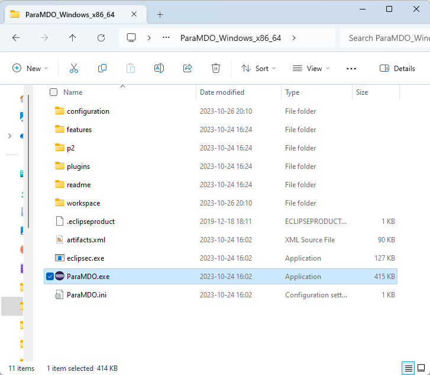

Select a directory as workspace. A new `workspace` folder will be created in the tool directory by default.

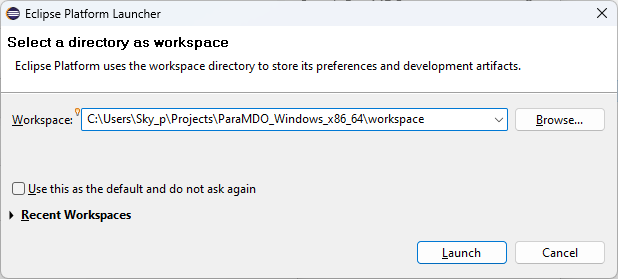

### 2. Basic layout

The layout of the tool will be like the image below.

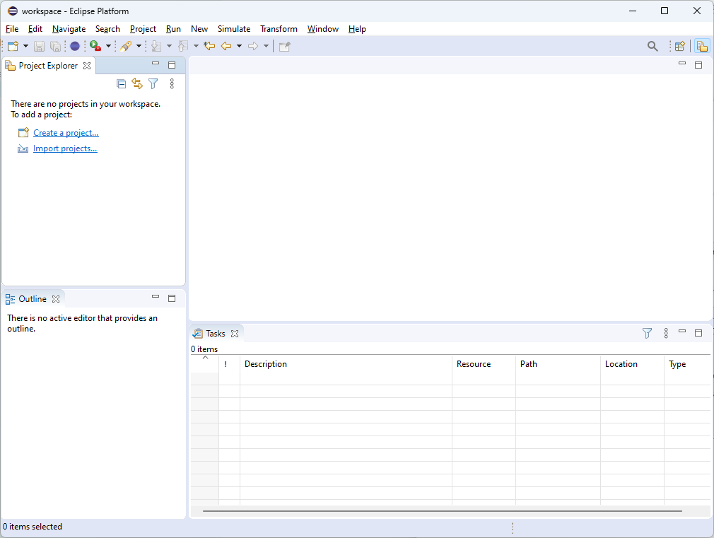

The `Properties` view is useful and can be opened at `Window > Show View > Properities`.


### 3. Create new project / Open exist project

To create a new modeling project, select `New > New modeling project...`.


Give project a name, and click `Create`.

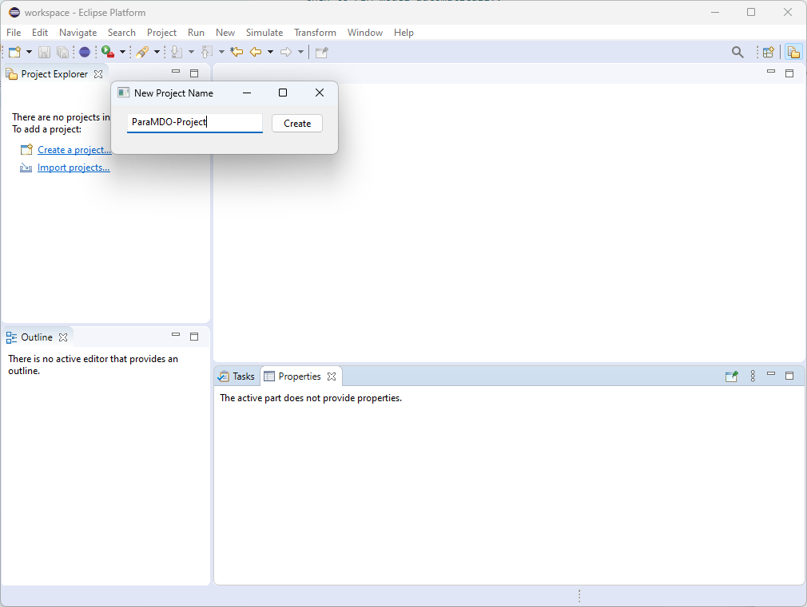

The project will be listed in the *Project Explorer*.

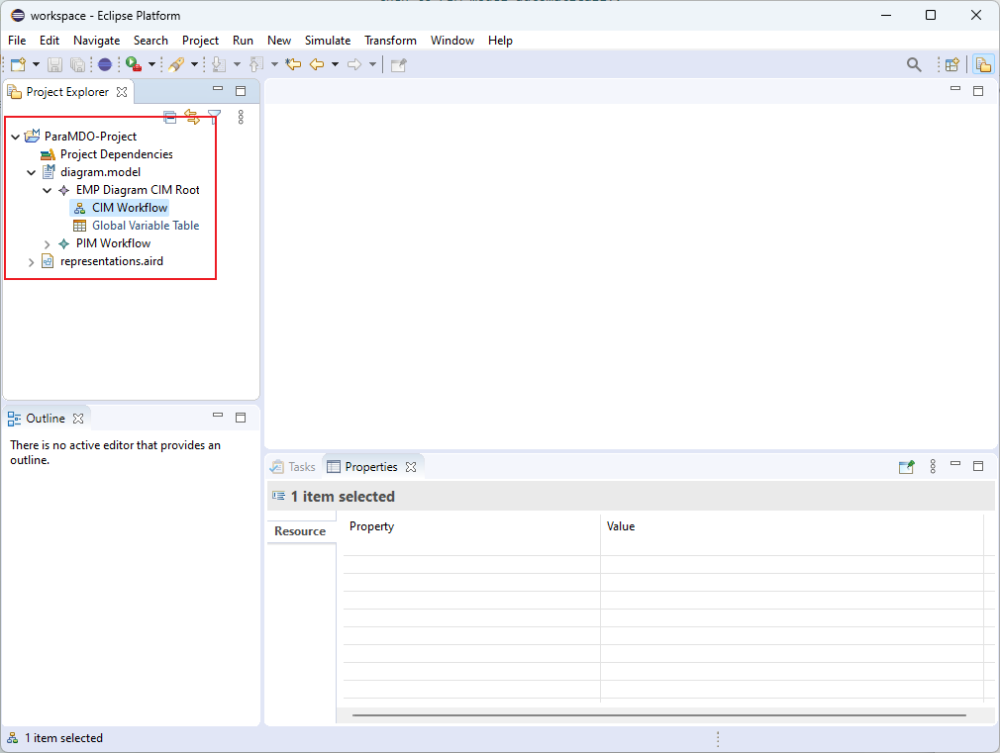

To open exist project, select `File > Open Projects from File System...`


Select `Directory...`, and select the project folder in the explorer.

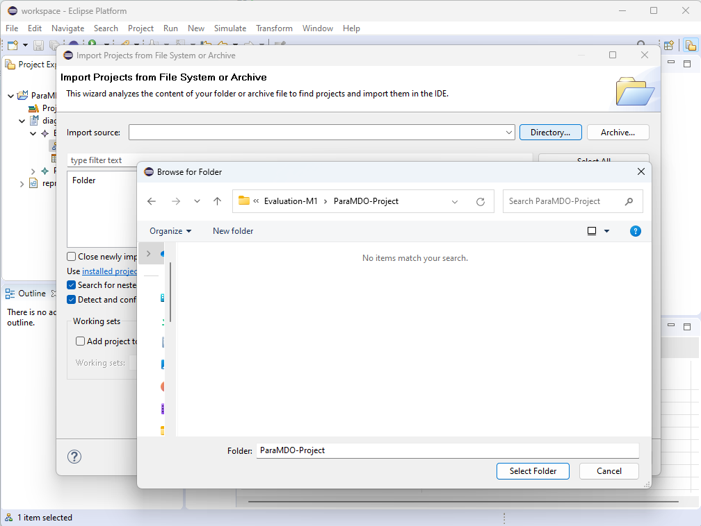

We provide several projects in the **Evaluation** folder of this repository.

### 4. CIM workbench

After having opened project in workspace, double click **CIM Workflow** to get into CIM workbench.

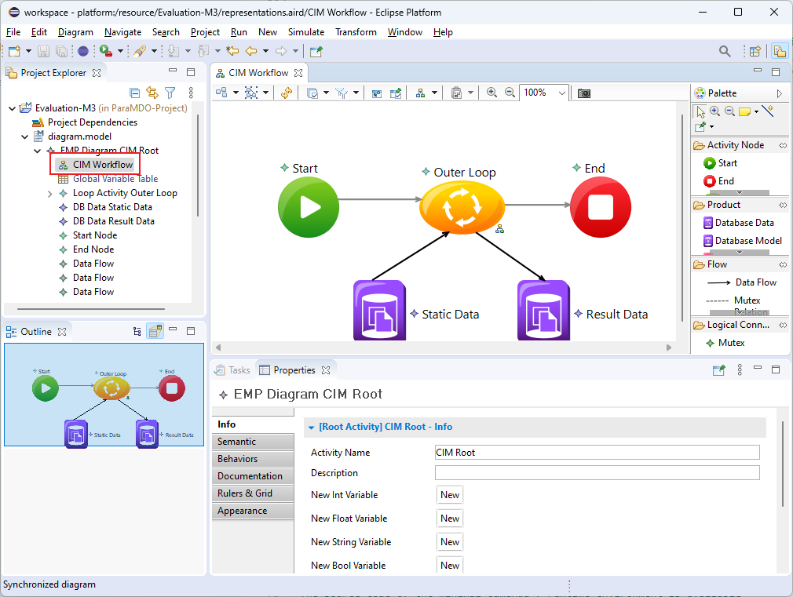

The **Global Variable Table** provide a table view to manage all variables needed by the CIM model.

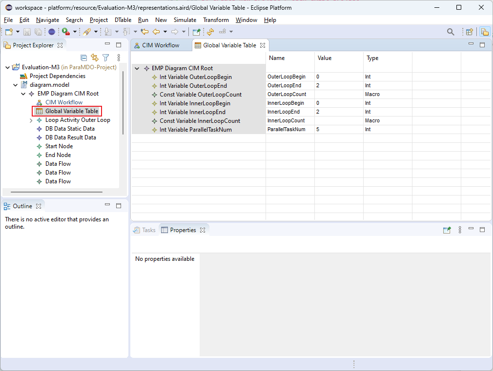

### 5. Semantic mapper

To transform the CIM model into PIM model, select `Transform > CIM to PIM`.


Choose the model to be transformed, click `Transform`.

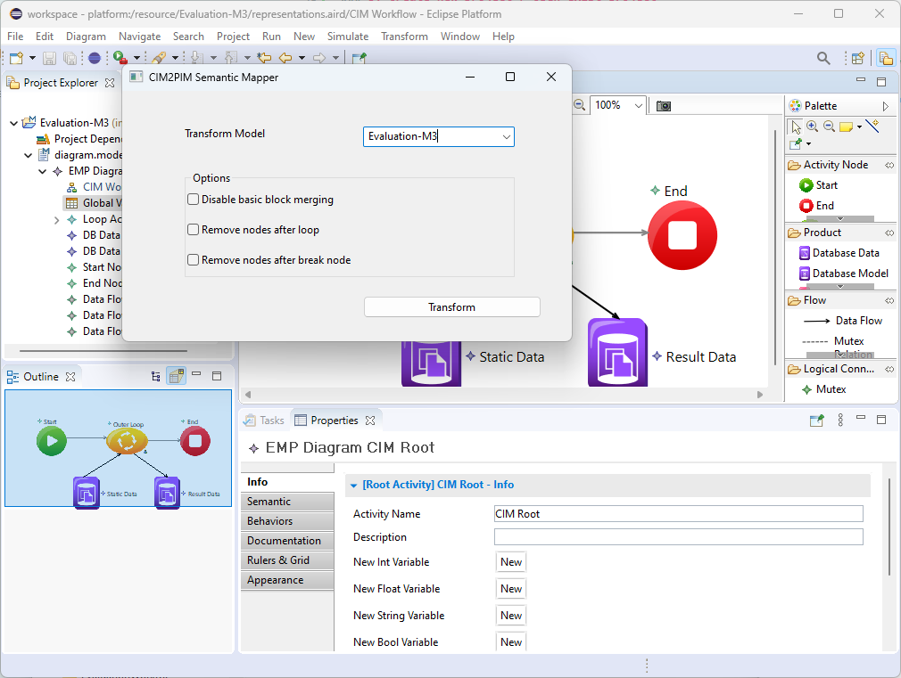

We also provide a workbench to view the generated PIM model.

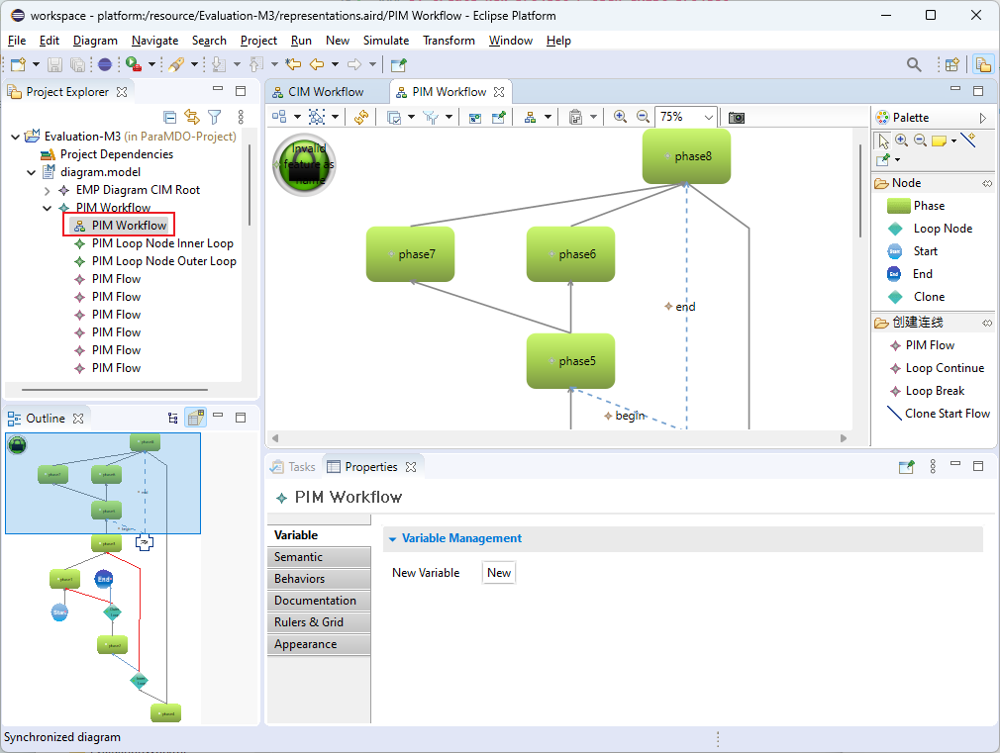

To further transform the model into PSM model, select `Transform > PIM to PSM`.


Choose the model to be transformed, click `Transform`.

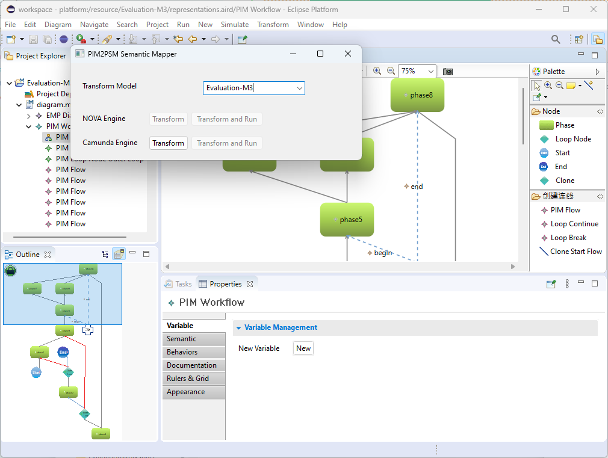

A `.bpmn` file will be generated in the work directory of the modeling project.

## Minimal Camunda 7 Runtime Environment

To evaluate the PSM model, we also provide a minimal Camunda 7 runtime environment. It is developed as a Spring Boot integration.

The source code of the minimal Camunda 7 runtime environment is available in the `ParaMDO-Camunda` folder.

### 1. Copy the workflow

Before run the environment, the workflow should be copy into the specific folder first.

Each modeling project has it's own work directory, where all the executable files and data files are located. The `.bpmn` file is also generated in this folder.

To run the workflow, we have to copy & paste this folder into `ParaMDO-Camunda/src/main/resources`.

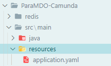

### 2. Run in Docker

The Minimal Camunda 7 Runtime Environment is ready to run in Docker. For more details, please refer to the `Dockerfile` and `docker-compose.yml`.

To run in Docker, run

```bash
docker compose up -d
```

in terminal.

### 3. Run locally

The Minimal Camunda 7 Runtime Environment relies on Redis. To run locally, please provide a Redis instance, and edit the Redis server address in `ParaMDO-Camunda\src\main\java\org\buaa\pomes\camunda\config\RedissonConfig.java`

### 4. Access in browser

The dashboard will be available at `localhost:8080` by default. The username and password is `demo` by default.

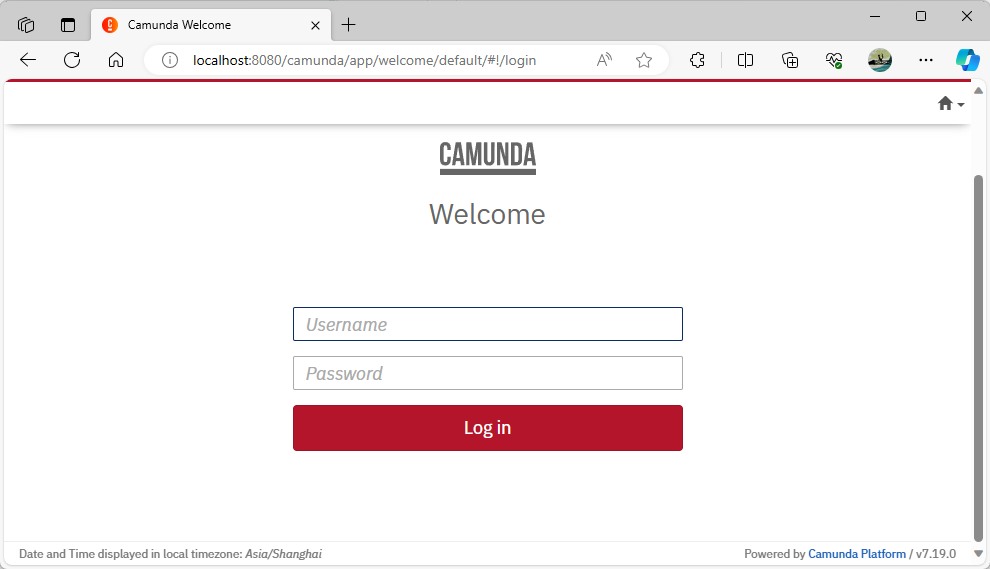

Select `Tasklist > Start process`, and all runnable workflows will be listed.

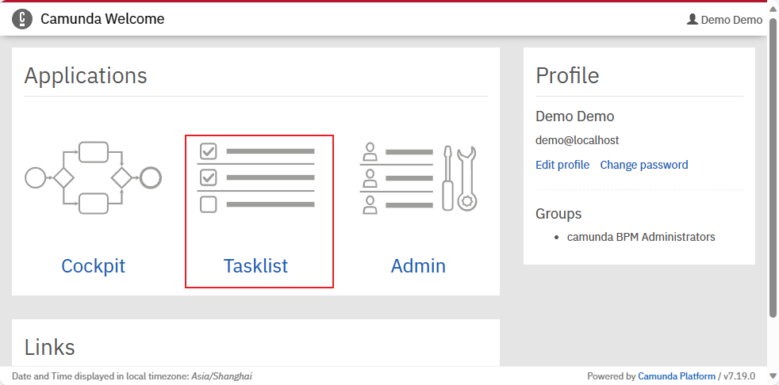

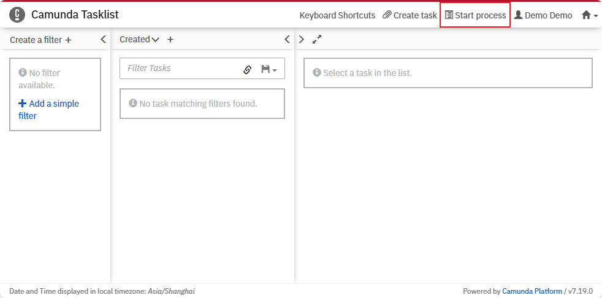

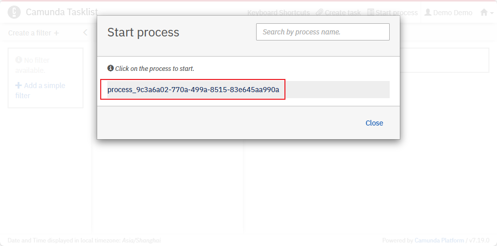
